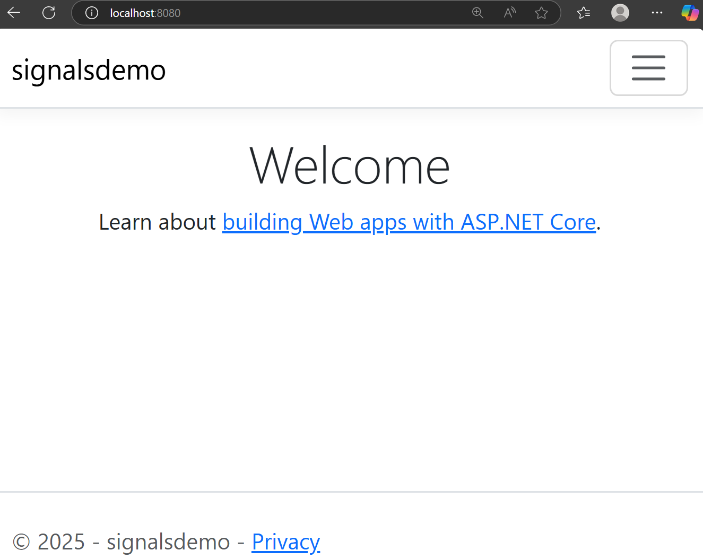

# Signals Demo for Azure Container Apps

From Azure container Apps docs - [Shutdown](https://learn.microsoft.com/en-us/azure/container-apps/application-lifecycle-management#shutdown):

    The containers are shut down in the following situations:

    As a container app scales in
    As a container app is being deleted
    As a revision is being deactivated
    When a shutdown is initiated, the container host sends a SIGTERM message to your container. The code implemented in the container can respond to this operating system-level message to handle termination.

    If your application doesn't respond within 30 seconds to the SIGTERM message, then SIGKILL terminates your container.

    Additionally, make sure your application can gracefully handle shutdowns. Containers restart regularly, so don't expect state to persist inside a container. Instead, use external caches for expensive in-memory cache requirements.

## Test container locally

```sh
docker build -t signalsdemo .
docker run --rm -p 8080:80 signalsdemo

# Open the web app locally in your browser
# Press: CTRL+C in the terminal
```

**Console output:**

```
warn: Microsoft.AspNetCore.DataProtection.Repositories.FileSystemXmlRepository[60]
      Storing keys in a directory '/root/.aspnet/DataProtection-Keys' that may not be persisted outside of the container. Protected data will be unavailable when container is destroyed. For more information go to https://aka.ms/aspnet/dataprotectionwarning
warn: Microsoft.AspNetCore.DataProtection.KeyManagement.XmlKeyManager[35]
      No XML encryptor configured. Key {xxxx-xxxx-xxxx-xxxx-xxxx} may be persisted to storage in unencrypted form.
warn: Microsoft.AspNetCore.Hosting.Diagnostics[15]
      Overriding HTTP_PORTS '8080' and HTTPS_PORTS ''. Binding to values defined by URLS instead 'http://*:80'.
info: Microsoft.Hosting.Lifetime[14]
      Now listening on: http://[::]:80
info: Microsoft.Hosting.Lifetime[0]
      Application started. Press Ctrl+C to shut down.
info: Microsoft.Hosting.Lifetime[0]
      Hosting environment: Production
info: Microsoft.Hosting.Lifetime[0]
      Content root path: /app
warn: Microsoft.AspNetCore.HttpsPolicy.HttpsRedirectionMiddleware[3]
      Failed to determine the https port for redirect.
^Cinfo: Microsoft.Hosting.Lifetime[0]
      Application is shutting down...
info: Program[0]
      SIGTERM received. Starting graceful shutdown...
info: Program[0]
      Cleanup complete. Exiting.
```

**UI updates during cleanup**:

* Initial state

<br/>

* SIGTERM received

<br/>

* Application stopping handler exited


## Deploy to Azure Container Apps

```sh
az acr build --image signalsdemo:1.0.0 --registry myregistry . -f Dockerfile

az extension add --name containerapp --upgrade --allow-preview true
az provider register --namespace Microsoft.App
az provider register --namespace Microsoft.OperationalInsights

az group create -name my-container-app --location australiaeast

az containerapp up \
    --name my-container-app \
    --resource-group my-container-apps \
    --location australiaeast \
    --environment 'my-container-apps' \
    --image mcr.microsoft.com/k8se/quickstart:latest \
    --target-port 80 \
    --ingress external \
    --registry-server myregistry.azurecr.io
    --registry-password <acr-adminuser-password> \
    --registry-username myregistry \
    --query properties.configuration.ingress.fqdn
```

**Security tip**: Use managed identities instead of ACR admin user credentials, see [Azure Container Apps image pull with managed identity](https://learn.microsoft.com/en-us/azure/container-apps/managed-identity-image-pull?tabs=bash&pivots=console)

Make a change to the container app configuration to force a new revision to be deployed and cause the container app to receive the SIGTERM signal.  Watch the messages in your browser and inspection the logs for the conmtainer app.

```sh
az containerapp update \
    -n my-container-app \
    -g my-container-apps \
    --set-env-vars DUMMY=1
```
